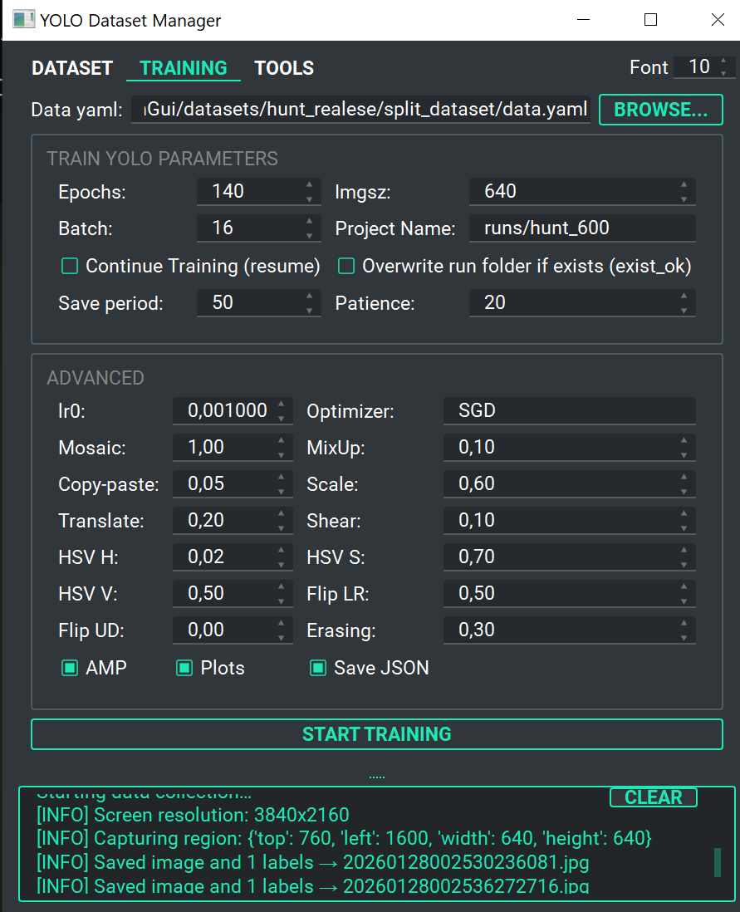
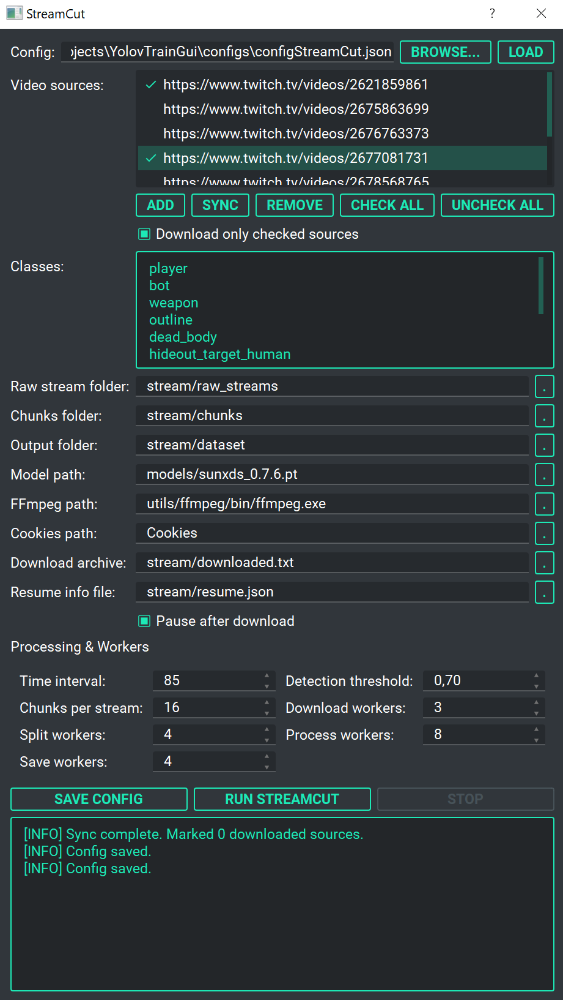

<div align="center">

# 🚀 **YDS — YOLO Dataset Studio** 🎯
## 🤖 Professional Object Detection Dataset Management Platform

<p align="center">
  <a href="README.md">🇺🇸 <b>English</b></a> | <a href="docs/README_ru.md">🇷🇺 Русский</a>
</p>

<p align="center">
  <a href="#"></a>
  <a href="#"></a>
  <a href="#"></a>
  <a href="LICENSE"></a>
</p>

> **Complete toolkit** for collecting, labeling, splitting, and training YOLO v8-v12 object detection models. Automated Twitch VOD mining, semi-automatic screen capture, intelligent label correction, and integrated training. Purpose-built for esports analysis and computer vision research. 🖥️🎮📊

</div>

## 📝 **Overview**

**YDS — YOLO Dataset Studio** is a unified PyQt5 desktop application that eliminates fragmented workflows in object detection dataset creation. From raw Twitch streams to production-ready YOLO models, everything happens in one place with minimal manual intervention.

**Key Differentiators:**
- ✅ **Automated VOD mining** — Download and process Twitch streams intelligently
- ✅ **Semi-automatic labeling** — AI-powered screen capture with YOLO detection
- ✅ **Professional label tool** — Intuitive click-based annotation correction
- ✅ **One-click splitting** — Train/val/test partitioning with custom ratios
- ✅ **Integrated training** — Full YOLO training pipeline with hyperparameter tuning
- ✅ **Real-time monitoring** — Live metrics and progress tracking

---

## ⚡ **Quick Feature Highlights**

### 🎯 **Core Capabilities**
| Feature | Capability | Use Case |
|---------|-----------|----------|
| 📹 **StreamCut** | Download Twitch VODs, segment, infer, extract | Mining esports gameplay automatically |
| 🎮 **Screen Capture** | Real-time YOLO detection on screen | Game detection (Valorant, CS2, Hunt) |
| 🖌️ **Label Tool** | Right-click add, left-click remove bounding boxes | Manual correction and verification |
| 📦 **Dataset Split** | Auto partition train/val/test with ratios | Prepare data for training |
| ⚙️ **Training** | Integrated Ultralytics YOLO with tuning | Train custom models with presets |
| 📊 **Visualization** | Confusion matrix, F1/PR curves, loss plots | Analyze training results |

### 🎮 **Optimized For Gaming**
- **Valorant** — Player, head, weapon detection
- **CS2** — Enemy, teammate, weapon classification
- **Hunt Showdown** — Hunter, target localization
- **Lost Light** — Extraction tracking
- **Apex Legends** — Legend, weapon identification
- **Call of Duty** — Cross-game detection



---

## 🛠️ **System Requirements**

| Component | Requirement | Details |
|-----------|-------------|---------|
| **GPU** | NVIDIA CUDA 11.8+ | GTX 1060+ for real-time inference |
| **RAM** | 8GB minimum | 16GB+ for large datasets |
| **Storage** | 20GB+ | For models and datasets |
| **Screen** | 1080p+ | Recommended for GUI |
| **Internet** | Required | For VOD downloading (StreamCut) |

### 📦 **Python Dependencies** (all included in requirements.txt)
```
PyQt5>=5.15              opencv-python>=4.8       ultralytics>=8.0
torch>=2.0               numpy>=1.21              mss>=6.1
screeninfo>=0.8          yt-dlp>=2024.01          onnxruntime>=1.16
```

---

## 📥 **Installation**

### **Quick Start (Windows)**
```bash
# 1. Clone repository
git clone https://github.com/ReksarGames/YolovTrainGui.git
cd YolovTrainGui

# 2. Run setup
setup.bat

# 3. Launch
python GUI.py
```

### **Manual Setup (All Platforms)**
```bash
# 1. Create environment
python -m venv venv
source venv/bin/activate      # Linux/macOS
# or
venv\Scripts\activate          # Windows

# 2. Install dependencies
pip install -r requirements.txt

# 3. Launch
python GUI.py
```

---

## 🎮 **Complete Workflow**

### **Step 1️⃣: Data Collection — Semi-Automatic Screen Capture**

**What it does:** Automatically captures game footage and labels objects using a pre-trained YOLO model

**How to use:**
1. Launch: `python GUI.py`
2. Go to **Data Collection Tab**
3. **Configure in GUI:** Select detection model, set confidence threshold, crop size, save interval, etc.
4. Click **Start Capture** — Application monitors your screen
5. When objects are detected (above threshold), frames are automatically saved
6. Click **Stop** when done
7. Results saved to `dataset_output/images/` and `dataset_output/labels/`

<details>
<summary>📋 <b>Configuration Details (Click to expand)</b></summary>

```json
{
  "model_path": "models/sunxds_0.7.6.pt",
  "classes": ["player", "head", "weapon"],
  "grabber": {
    "crop_size": 0.8,      // 80% of center screen
    "width": 640,          // Fixed width
    "height": 640          // Fixed height
  },
  "detection_threshold": 0.5,
  "save_interval": 3       // Seconds between saves
}
```

**Configuration Parameters:**
- **model_path** — YOLO model for detection
- **classes** — Objects to capture (order = class ID)
- **crop_size** — Percentage of screen to capture (0-1)
- **detection_threshold** — Min confidence to save frame (0-1)
- **save_interval** — Seconds between saves (prevents duplicates)

**Output format:**
```
dataset_output/
├── images/
│   ├── capture_001.jpg
│   └── ...
└── labels/
    ├── capture_001.txt    # YOLO: <class_id> <x> <y> <w> <h>
    └── ...
```

</details>


---

### **Step 2️⃣: Label Verification — Manual Correction**

**What it does:** Review and correct AI-generated labels for accuracy

**How to use:**
1. Open **Data Tab** → Click **Label Tool** button (GUI)
2. Browse through images
3. Verify bounding boxes are correct
4. Make corrections as needed

<details>
<summary>⌨️ <b>Keyboard Controls (Click to expand)</b></summary>

| Control | Action |
|---------|--------|
| 🖱️ **Right-Click** | Add bounding box (current class) |
| 🖱️ **Left-Click** | Remove box under cursor |
| 🖱️ **Drag Corner** | Resize box |
| **Dropdown** | Change class |
| **Spacebar** | Toggle label visibility |
| **N / P** | Next / Previous image |
| **D** | Delete image |
| **S** | Save changes |
| **Q** | Quit |

</details>

---

### **Step 3️⃣: Dataset Preparation — Automatic Splitting**

**What it does:** Partition labeled data into training/validation/testing sets

**How to use:**
1. Go to **Dataset Tab**
2. Select folder with `images/` + `labels/`
3. Click **Split Dataset**
4. Choose ratios (default: 70% train / 15% val / 15% test)

<details>
<summary>🔧 <b>CLI Method (Click to expand)</b></summary>

```bash
python Core/splitDatasetFiles.py \
  --data-folder dataset_output \
  --train-ratio 0.7 \
  --val-ratio 0.15 \
  --test-ratio 0.15
```

</details>

**Output structure:**
```
dataset_output_split/
├── train/          # ~70% training data
│   ├── images/
│   └── labels/
├── val/            # ~15% validation data
│   ├── images/
│   └── labels/
└── test/           # ~15% test data
    ├── images/
    └── labels/
```

**Create `data.yaml` for training:**
```yaml
path: /absolute/path/to/dataset_output_split
train: train/images
val: val/images
test: test/images

nc: 3
names:
  0: player
  1: head
  2: weapon
```

---

### **Step 4️⃣: Model Training — Integrated YOLO Pipeline**

**What it does:** Train a custom YOLO detector on your labeled dataset

**How to use:**
1. Open **Training Tab**
2. Select `data.yaml` path
3. Choose base model (yolov8n/s/m, yolov12s/m/l)
4. Set hyperparameters in GUI
5. Click **Start Training**

**Essential Hyperparameters:**

| Parameter | Default | Description |
|-----------|---------|-------------|
| **Epochs** | 50 | Training iterations (more = better but slower) |
| **Image Size** | 640 | Input resolution (larger = slower but better small objects) |
| **Batch Size** | 16 | Images per step (larger = faster) |
| **Learning Rate** | 0.01 | Optimization step size |
| **Optimizer** | SGD | Gradient descent variant (SGD/Adam/AdamW) |
| **Patience** | 15 | Early stopping (epochs without improvement) |

<details>
<summary>⚡ <b>Advanced Options (Click to expand)</b></summary>

**Augmentation:**
```json
{
  "mosaic": 1.0,        // Multi-scale training
  "mixup": 0.1,         // Image mixing
  "fliplr": 0.5,        // Horizontal flip
  "flipud": 0.0,        // Vertical flip
  "scale": 0.5,         // Random scaling
  "hsv_h": 0.015,       // Hue shift
  "hsv_s": 0.7,         // Saturation
  "hsv_v": 0.4          // Brightness
}
```

**Regularization & Performance:**
```json
{
  "amp": true,          // Automatic Mixed Precision (faster)
  "patience": 20,       // Early stopping threshold
  "save_period": 10,    // Save every N epochs
  "weight_decay": 0.0005
}
```

</details>

**Training output:**
```
runs/valorant/exp1/
├── weights/
│   ├── best.pt          # Best model (highest mAP)
│   └── last.pt          # Last epoch
├── results.csv          # All metrics
└── plots/
    ├── confusion_matrix.png
    ├── F1_curve.png
    ├── PR_curve.png
    └── results.png
```

---

## 🎬 **Advanced Tools**

### **StreamCut — Automated VOD Processing**

**What it does:**
- 📥 **Download** Twitch VODs automatically
- 🎬 **Split** videos into intelligent segments
- 🤖 **Detect** objects using your YOLO model
- 💾 **Save** only frames with target objects

This allows you to mine **thousands of labeled images** from Twitch streams **without manual work**, using an already-trained YOLO model to automatically extract relevant frames and generate labels.

**Pipeline visualization:**
```
Twitch VOD
    ↓
📥 Download (parallel via yt-dlp)
    ↓
🪓 Split into segments (FFmpeg)
    ↓
🤖 YOLO Detection (check every N frames)
    ↓
💾 Save matching frames + labels
    ↓
Training Dataset
```

**Key parameters:**
- **max_download_workers** (2-3) — How many videos download simultaneously (max 3 to avoid ban)
- **split_workers** (CPU cores) — Threads for video segmentation using FFmpeg
- **process_workers** (GPU) — GPU threads running YOLO detection (each worker processes chunks and extracts frames based on interval)
- **save_workers** (1-2) — Disk I/O threads for saving results



---

### **🤖 ONNX Model Benchmarking**

**What it does:** Test inference performance of multiple quantized models to find the best balance between speed and accuracy.

Quickly evaluate different YOLO models and identify which one:
- Detects with highest confidence
- Achieves best accuracy on your data
- Runs at desired speed for your use case

**How to use:**
1. Go to **Tools** → **Benchmark ONNX Models**
2. Select folder with `.onnx` models
3. Configure test image size
4. Click **Run Benchmark**
5. Results show inference time and performance metrics

---

### **📥 Model Manager**

**What it does:** One-click download of official YOLO weights for quick experimentation.

**How to use:**
1. Go to **Tools** → **YOLO Model Download**
2. Select size: N (nano), S (small), M (medium), L (large), X (xlarge)
3. Select version: v8, v10, v11, v12
4. Click download — saves to `models/` folder

Immediately start using models without manual downloading!

---


## 📁 **Project Structure**

```
YolovTrainGui/
│
├── 📄 GUI.py                          # Main application
├── 📄 setup.bat                       # Windows automated setup
├── 📋 requirements.txt                # Python dependencies
├── 📖 README.md                       # English guide (you are here)
├── � docs/
│   ├── 📖 README_ru.md                # Russian guide
│   ├── 📖 HELP.md                     # Configuration reference (English)
│   └── 📖 HELP_ru.md                  # Configuration reference (Russian)
│
├── 📂 Core/                           # Core modules
│   ├── train.py                       # YOLO training pipeline
│   ├── StreamCut.py                   # VOD processor
│   ├── semiauto_dataset_collector.py  # Screen capture
│   ├── labelConfig.py                 # Label verification tool
│   └── splitDatasetFiles.py           # Dataset splitter
│
├── 📂 configs/                        # Configuration files
│   ├── config.json                    # Main settings
│   └── configStreamCut.json           # StreamCut settings
│
├── 📂 benchmark/                      # Performance testing
│   ├── benchmark.py
│   └── models/                        # ONNX models for testing
│
├── 📂 models/                         # YOLO weights (.pt)
│
├── 📂 datasets/                       # Training datasets
│
├── 📂 stream/                         # StreamCut output
│   ├── raw_streams/
│   ├── chunks/
│   └── dataset/
│
├── 📂 runs/                           # Training results
│
├── 📂 docs/                           # Documentation
│   └── images/                        # Screenshots & diagrams
│
└── 📂 utils/                          # Utilities (ffmpeg, etc.)
```

---

## � **Perfect For**

<table>
  <tr>
    <td width="50%">
      <h3>🎮 Gaming Streamers & Content Creators</h3>
      <p><b>Goal:</b> Build custom detection overlays</p>
      <ul>
        <li>Collect 2000+ frames via screen capture</li>
        <li>Quick label verification (50+ samples)</li>
        <li>Train model in 1-2 hours</li>
        <li>Export for OBS/streaming</li>
      </ul>
      <p><i>Examples: Valorant rank detector, player tracking</i></p>
    </td>
    <td width="50%">
      <h3>📊 Esports Analysts</h3>
      <p><b>Goal:</b> Track players across tournaments</p>
      <ul>
        <li>Mine Twitch VODs (auto-labeled via StreamCut)</li>
        <li>5000+ images in minutes (no manual work)</li>
        <li>Combine multi-game datasets</li>
        <li>Fine-tune for consistency</li>
      </ul>
      <p><i>Examples: Cross-game player recognition, team analysis</i></p>
    </td>
  </tr>
  <tr>
    <td width="50%">
      <h3>🔬 ML Researchers</h3>
      <p><b>Goal:</b> Iterate on custom datasets</b></p>
      <ul>
        <li>Collect experiment footage automatically</li>
        <li>Manual verification with built-in tools</li>
        <li>Train → evaluate → iterate cycle</li>
        <li>Publish reproducible results</li>
      </ul>
      <p><i>Examples: Computer vision research, specialized detection</i></p>
    </td>
    <td width="50%">
      <h3>🤖 Game Developers</h3>
      <p><b>Goal:</b> In-game AI training data</p>
      <ul>
        <li>Capture gameplay scenarios</li>
        <li>Build detection for game mechanics</li>
        <li>Train custom YOLO models</li>
        <li>Integrate into game engine</li>
      </ul>
      <p><i>Examples: Enemy detection, item recognition systems</i></p>
    </td>
  </tr>
</table>

---

## 🔗 **Quick Links**

| Resource | Description |
|----------|-------------|
| [📖 Configuration Guide](docs/HELP.md) | Detailed config.json & StreamCut settings |
| [📖 Russian Guide](docs/README_ru.md) | 🇷🇺 Полное руководство на русском |
| [📖 Changelog](docs/CHANGELOG.md) | What's new in documentation |
| [⚙️ config.json](configs/config.json) | Main application settings |
| [🎬 StreamCut Config](configs/configStreamCut.json) | VOD processing parameters |

---

## ❓ **FAQ**

**Q: How much data do I need?**  
A: Minimum 500-1000 images per class. Better with 2000-5000+.

**Q: Should I use GPU?**  
A: Yes! 10-30x faster. RTX 3060 is a good entry point. CPU works but is slow.

**Q: Can I train without collecting data?**  
A: Yes! Use StreamCut to automatically mine Twitch VODs.

**Q: What YOLO version should I use?**  
A: Start with v8n (fast) or v12s (better accuracy). Increase for better results.

**Q: How to deploy trained model?**  
A: Export from `runs/*/weights/best.pt` to your inference script.

**Q: How does StreamCut generate labels?**  
A: It uses your YOLO model to detect objects in each frame, then saves detections in YOLO format.

**Q: What if a model is banned for copyright?**  
A: Download another model using Model Manager or train your own.

---

## 🤝 **Contributing**

Contributions welcome! Areas to improve:
- YouTube support (StreamCut)
- Cloud dataset storage
- Web UI version
- Additional game optimizations
- Mobile app

---

## 📝 **License**

MIT License — See [LICENSE](LICENSE)

---

## 🙌 **Acknowledgments**

- [Ultralytics YOLO](https://github.com/ultralytics/ultralytics) — Amazing detection framework
- [PyQt5](https://www.riverbankcomputing.com/software/pyqt) — GUI framework
- [yt-dlp](https://github.com/yt-dlp/yt-dlp) — VOD downloader
- Community feedback and contributions

---

<div align="center">

**Made with ❤️ for the computer vision community**

[⭐ Star on GitHub](https://github.com/ReksarGames/YolovTrainGui) | [🐛 Report Issue](https://github.com/ReksarGames/YolovTrainGui/issues) | [📧 Contact](https://github.com/ReksarGames)

**Happy detecting! 🚀**

</div>
