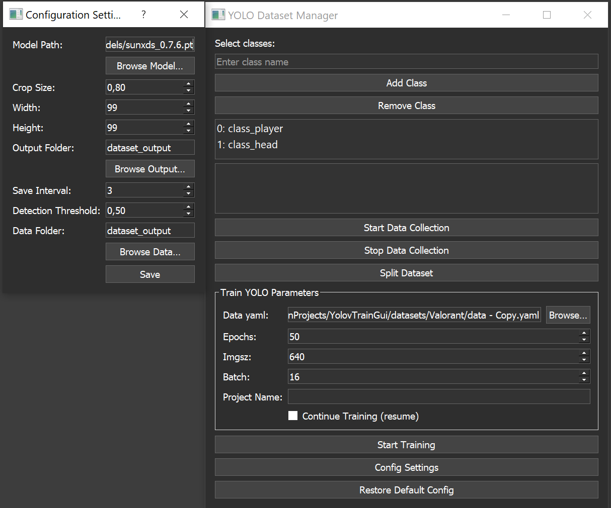

<p align="right">
  <a href="README.md">🇺🇸 English</a> | <a href="README_ru.md">🇷🇺 Русский</a>
</p>

# 🚀 YDS — YOLO Dataset Studio 🎯

> Interactive toolkit for **collecting**, **labeling**, **splitting**, and **training** object detection datasets for Ultralytics YOLO (v12 and compatible). 🖥️📊

**YOLO Flow Studio** is a desktop application with a graphical interface (PyQt5) that handles the complete workflow of YOLO dataset management:

[📹 StreamCut — automated tool for downloading, splitting, and processing Twitch VOD](https://github.com/ReksarGames/StreamCut)



- 🤖 Semi-automatic **screen dataset collection** using a pretrained YOLO model.
- ✏️ **Manual labeling correction** tool.
- 📂 **Automatic splitting** into `train/val/test`.
- 🏋️ **Initiating training** of Ultralytics YOLO with configurable hyperparameters.
- 📈 **Real-time logging** of data collection and training progress.

## 🌟 Features

- 🎛️ **Interactive GUI:** PyQt5-based intuitive interface.
- 🧲 **Semi-Automatic Dataset Collection:** Automatically captures screen images labeled by pretrained YOLO models.
- 🖍️ **Labeling Tool:** Manual labeling corrections via intuitive mouse controls.
- 📦 **Dataset Splitting:** Automatically splits datasets into training, validation, and testing sets.
- ⚙️ **Configurable Training:** Set epochs, image size, batch size, and more.
- ⏱️ **Real-time Logging:** Immediate feedback on dataset collection and model training.

## 🛠️ Requirements

- Python 3.8+  
- PyQt5  
- OpenCV (`opencv-python`)  
- Ultralytics (`ultralytics`)  
- PyTorch (`torch`)  
- MSS (`mss`), `screeninfo`, `numpy` 

## 📥 Installation

```bash
git clone https://github.com/your-repo/YOLOv12-Dataset-Manager.git
cd YOLOv12-Dataset-Manager
pip install -r requirements.txt
```

## 🎮 Usage

### 🚦 Launching the Application

```bash
python GUI.py
```

### 🔑 Key Functionalities

- 📸 **Data Collection:**
  - Begin automatic image capture and labeling from your screen.
- 🖌️ **Label Correction:**
  - Right-click to add bounding boxes; left-click to remove bounding boxes.
- 📚 **Dataset Management:**
  - Split datasets into `train`, `val`, and `test` subsets automatically.
- 🚀 **Model Training:**
  - Adjust training parameters via GUI, then initiate training.

## ⚙️ Configuration

Adjust settings in `config.json` or via the GUI:

```json
{
  "model_path": "models/sunxds_0.7.6.pt",
  "classes": ["class_player", "class_head"],
  "grabber": { "crop_size": 0.8, "width": 640, "height": 640 },
  "output_folder": "dataset_output",
  "save_interval": 3,
  "detection_threshold": 0.5,
  "data_folder": "dataset_output",
  "last_data_yaml": "datasets/Valorant/data.yaml"
}
```

### 🧩 Steps

1. 🎥 **Data Collection (Semi-Auto)**  
Start screen capture via GUI by pressing `Start Capture`. Captured images and labels will be saved automatically. Press `Stop` to end capture.

2. 🎨 **Manual Label Correction**  
Use the labeling tool accessible via GUI or by running `labelConfig.py`.

- **Right-click** — Add bounding box of selected class.
- **Left-click** — Remove bounding box under cursor.
- **Class switching** — Via GUI class list.

3. 📁 **Dataset Splitting**  
Split dataset via GUI (`Split` button) or command line:

```bash
python splitDatasetFiles.py
```

Default output structure:

```
dataset_output_split/
├── train/
│   ├── images/
│   └── labels/
├── val/
│   ├── images/
│   └── labels/
└── test/
    ├── images/
    └── labels/
```

4. 🏅 **Training**  
Specify the `data.yaml` (with paths to train/val), set hyperparameters (epochs, imgsz, batch) in GUI, and press `Train`.

CLI version:

```bash
python train.py \
  --model models/yolov12s.pt \
  --data datasets/your_dataset/data.yaml \
  --epochs 50 \
  --imgsz 640 \
  --batch 16 \
  --project runs/exp \
  --name auto
```

## 📌 Project Structure

```
YOLO-Flow-Studio
├── dataset_output/
│   ├── images/
│   └── labels/
├── models/
│   └── yolov12s.pt
├── GUI.py                  # Main GUI
├── labelConfig.py          # Manual labeling tool
├── semiauto_dataset_collector.py  # Screen capture and auto-labeling
├── splitDatasetFiles.py    # Dataset splitting script
├── train.py                # YOLO training script
├── config.json             # Configuration file
├── LICENSE                 # MIT License
└── gui.puml                # (optional)

```

---

# 🚀 StreamCut

Automated tool for downloading, slicing and processing Twitch VODs 🎥 using YOLO 🤖.  
It downloads VODs, splits them into time‑based segments, runs inference on selected frames, and saves only those frames containing your target classes—perfect for building training datasets!

---

## 📋 Overview

1. 📥 **Download**  
   Parallel VOD download via `yt-dlp`, with archive tracking to avoid duplicates.  
2. 🎞️ **Slice**  
   Split each video into `.ts` segments of fixed duration using `ffmpeg`.  
3. 🤖 **Infer**  
   Run YOLO on every Nth frame, save images & labels only when detections occur.  
4. ⚙️ **Parallelism**  
   Fully configurable worker pools for each stage: download, slice, inference, save.

---

## ✨ Key Features

- **Bulk VOD support** — download any number of Twitch VOD URLs.  
- **Selective frame extraction** — keeps only frames with non‑zero detections.  
- **Customizable parallelism** — control workers for each pipeline stage.  
- **Download archive** — maintains `downloaded.txt` to skip already‑fetched videos.  
- **Resumable processing** — optional `resume.json` to pick up where you left off.  
- **Ready‑to‑use dataset**  
  - `stream/dataset/images/*.jpg`  
  - `stream/dataset/labels/*.txt`  

---

## ⚙️ Configuration (`config.json`)

```jsonc
{
  "video_sources": [
    "https://www.twitch.tv/videos/2522936875",
    "https://www.twitch.tv/videos/2524662899"
  ],
  "raw_stream_folder":  "stream/raw_streams",    // Downloaded VODs
  "chunks_folder":      "stream/chunks",         // .ts segments
  "output_folder":      "stream/dataset",        // images/ & labels/
  "time_interval":      3,                       // Inference every N frames
  "detection_threshold": 0.3,                    // YOLO confidence threshold
  "model_path":         "models/sunxds_0.7.6.pt",// Path to your .pt model
  "class_map": {
    "player": 0,
    "head":   7
  },

  // 👷 Worker pools
  "max_download_workers": 2,   // 🛠 Parallel downloads (yt-dlp)
  "split_workers":        4,   // 🪓 ffmpeg slicing
  "process_workers":      6,   // 🔍 YOLO inference
  "save_workers":         2,   // 💾 Disk writes (images + labels)

  "download_archive":  "stream/downloaded.txt", // Tracks downloaded URLs
  "resume_info_file":  "stream/resume.json"     // Tracks processed segments
}

```

| Parameter              | Emoji | Description                                                | Recommended                           |
| ---------------------- | :---: | ---------------------------------------------------------- | ------------------------------------- |
| `max_download_workers` |   🛠  | Number of parallel `yt-dlp` download threads               | 2–4 (avoid saturating your network)   |
| `split_workers`        |   🪓  | Threads for slicing `.ts` files into fixed‑length segments | \~CPU cores                           |
| `process_workers`      |   🔍  | Concurrent YOLO inference processes (one per chunk)        | Based on GPU capacity                 |
| `save_workers`         |   💾  | Threads dedicated to saving images & label files to disk   | 1–2 (prevents I/O blocking inference) |

```
📂 Directory Structure

├── StreamCut.py
├── config.json
├── models/
│   └── sunxds_0.7.6.pt
└── stream/
    ├── raw_streams/      # Downloaded VODs
    ├── chunks/           # .ts segments
    ├── downloaded.txt    # Archive of fetched URLs
    ├── resume.json       # (Optional) resume state
    └── dataset/
        ├── images/       # Saved frames (.jpg)
        └── labels/       # YOLO labels (.txt)

```

📝 Notes
+ time_interval is in frames for inference. If you want “every 10 seconds”, compute interval_frames = fps * 10.
+ resume.json is created automatically on first run—no manual steps needed.
+ Adjust worker counts based on your hardware (CPU cores for slicing, GPU for inference, disk I/O for saving).