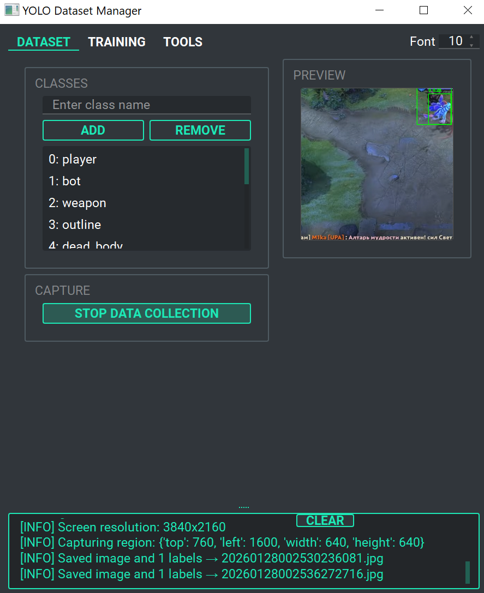
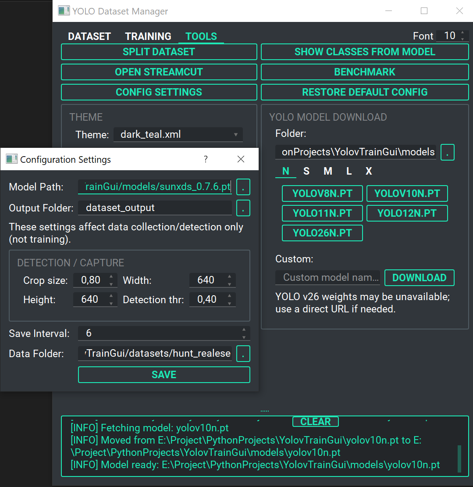

<div align="center">

# 🚀 **YDS — YOLO Dataset Studio**

## Automatically build YOLO datasets from Twitch streams and videos

<p align="center">
  <a href="README.md">🇺🇸 <b>English</b></a> | <a href="docs/README_ru.md">🇷🇺 Русский</a>
</p>

<p align="center">
  <a href="#"></a>
  <a href="#"></a>
  <a href="LICENSE"></a>
</p>

</div>

## 🎯 **What This Does**

**YDS** downloads Twitch VODs or captures your screen, extracts frames, and uses an existing YOLO model to automatically generate bounding box labels.
The result is a ready-to-use YOLO dataset (images + labels) for training.

**Why?** Creating YOLO datasets by hand is slow and repetitive. YDS automates most of this process while keeping you in control.

---

## 🚀 **TL;DR — Quick Start**

```
1. 📥 Capture screen or download Twitch VOD
2. 🤖 Auto-label frames with YOLO model
3. 🏷️ Manually verify & correct labels (add/remove/fix classes)
4. 📦 Split into train/val/test
5. ⚙️ Train YOLO model built-in
```

> **Note:** Label verification is a manual step where you can add, remove, or fix bounding boxes and classes on every image.

---

## 🎮 **Core Features**

| Feature | What It Does |
|---------|-------------|
| **📹 StreamCut** | Download Twitch VODs, auto-extract & label frames (fully automated) |
| **🎮 Screen Capture** | Record gameplay + auto-label with YOLO (semi-automatic) |
| **🖌️ Label Verification** | Manual annotation tool — add/edit classes on screenshots |
| **📦 Dataset Split** | Auto partition train/val/test with custom ratios |
| **⚙️ Training** | Built-in YOLO training interface |
| **📊 ONNX Benchmark** | Test model inference speed & accuracy |

---

## 🛠️ **System Requirements**

| Component | Requirement |
|-----------|-------------|
| **OS** | Windows 10/11 (primary), Linux (manual setup) |
| **Python** | 3.12+ |
| **GPU** | Recommended for real-time capture/inference |
| **CUDA** | Tested with 11.8 & 12.8 (newer versions compatible) |

---

## 📥 **Installation & Run**

| Platform | Install | Run |
|----------|---------|-----|
| **Windows** | `setup.bat` | `run.bat` |
| **Linux** | `./setup.sh` | `./run.sh` |

---

## 🔄 **Workflows**

### **1️⃣ Screen Data Collection**

1. Go to **Dataset Tab** → Click **Start Data Collection**
2. Configure: detection model, threshold, crop size, save interval
3. Frames & labels auto-saved to `output_folder` (see config.json)



---

### **2️⃣ Label Verification — Manual Correction**

Review and correct AI-generated labels, or add new bounding boxes with assigned classes.

1. Go to **Dataset Tab** → Click **Label Verification**
2. Opens interactive OpenCV window
3. View auto-labeled frames (or unlabeled screenshots)
4. Add new bounding boxes with class assignment
5. Edit or delete existing boxes
6. Save annotations in YOLO format

<details>
<summary><b>⌨️ Keyboard Controls</b> (click to expand)</summary>

| Control | Action |
|---------|--------|
| 🖱️ Right-Click | Add bounding box (current class) |
| 🖱️ Left-Click | Remove box under cursor |
| 🖱️ Drag Corner | Resize box |
| Dropdown | Change class |
| Spacebar | Toggle label visibility |
| N / P | Next / Previous image |
| D | Delete image |
| S | Save changes |
| Q | Quit |

</details>

---

### **3️⃣ Split Dataset**

Automatically splits your dataset into `train / val / test` folders using standard YOLO directory structure.

1. Go to **Tools** → **Split Dataset**
2. Select folder with `images/` and `labels/`
3. Click **Split** → Uses fixed ratios: **70% train / 15% val / 15% test**

**Output:**
```
dataset_split/
├── train/  (70%)
│   ├── images/
│   └── labels/
├── val/    (15%)
│   ├── images/
│   └── labels/
└── test/   (15%)
    ├── images/
    └── labels/
```

---

### **4️⃣ Training**

1. Go to **Training Tab**
2. Select `data.yaml`
3. Set basic parameters: **epochs, image size, batch size**
4. (Optional) Expand **Advanced Options** for augmentation & performance tuning
5. Click **Start Training**


<details>
<summary><b>⚡ Advanced Options</b> (click to expand)</summary>

**Augmentation Settings:**
```json
{
  "mosaic": 1.0,        // Multi-scale training
  "mixup": 0.1,         // Image mixing
  "fliplr": 0.5,        // Horizontal flip
  "flipud": 0.0,        // Vertical flip
  "scale": 0.5,         // Random scaling
  "hsv_h": 0.015,       // Hue shift
  "hsv_s": 0.7,         // Saturation
  "hsv_v": 0.4          // Brightness
}
```

**Regularization & Performance:**
```json
{
  "amp": true,          // Automatic Mixed Precision (faster training)
  "patience": 20,       // Early stopping threshold
  "save_period": 10,    // Save checkpoint every N epochs
  "weight_decay": 0.0005
}
```

**Training Output Structure:**
```
runs/valorant/exp1/
├── weights/
│   ├── best.pt          # Best model (highest mAP)
│   └── last.pt          # Last epoch
├── results.csv          # All metrics
└── plots/
    ├── confusion_matrix.png
    ├── F1_curve.png
    ├── PR_curve.png
    └── results.png
```

</details>

---

### **5️⃣ StreamCut & Auto-Labeling**

**What it does:** Download Twitch VODs, automatically extract frames, run YOLO inference, save labeled dataset.

1. Go to **Tools** → **Open StreamCut**
2. Add Twitch VOD URLs
3. Choose: download quality, YOLO model, detection threshold, worker threads
4. Downloads to `stream/raw_streams`, outputs labeled frames to `stream/dataset`

**How it works:**
- You provide a pre-trained YOLO model
- Tool downloads VOD and splits into segments
- Runs inference on every N frames
- Saves detections as YOLO-format labels
- Result: fully labeled dataset ready for training
- Button "Sync" отмечает уже скачанные стримы

**Key:** Better input model = better auto-labeled dataset

**StreamCut Interface:**


---

### **🤖 ONNX Model Benchmarking**

**What it does:** Run inference on multiple ONNX models to compare detection results and model outputs.

1. Go to **Tools** → **Benchmark ONNX Models**
2. Select folder with `.onnx` model files
3. Click **Run Benchmark** → Runs inference on each model with test images
4. Results show per-model comparison table:

```
Model                                    Shape        nCls  #   Classes      Conf1 
─────────────────────────────────────────────────────────────────────────────────
1.5kR6.onnx                              [8400, 6]    1     45  0            0.92
CS2 by Kwnema.onnx                       [8400, 7]    3     12  0,2,3        0.85
ABI_v3.onnx                              [8400, 84]   80    28  5,16,24      0.78
```

**Why use it:** Compare how different model architectures and quantizations detect objects in your test images.

---

### **📥 Model Manager**

**What it does:** One-click download of official YOLO weights for quick experimentation.

1. Go to **Tools** → **YOLO Model Download**
2. Select model size: N (nano) / S (small) / M (medium) / L (large) / X (xlarge)
3. Select version: v8 / v10 / v11 / v12
4. Click **Download** → Saves to `models/` folder

**Why use it:** Start training without hunting for model files. Pre-trained weights ready to use immediately.



---

## ⚙️ **Configuration**

- **configs/config.json** — GUI defaults, dataset collection, label verification settings
- **configs/configStreamCut.json** — StreamCut settings (download workers, thresholds, etc.)

Full reference: [docs/HELP.md](docs/HELP.md)

---

## 📁 **Project Structure**

```
YolovTrainGui/
│
├── 📄 GUI.py                          # Main application
├── 📄 setup.bat / run.bat             # Windows scripts
├── 📄 setup.sh / run.sh               # Linux scripts
├── 📋 requirements.txt                # Python dependencies
├── 📖 README.md                       # English guide (you are here)
│
├── 📂 docs/
│   ├── 📖 README_ru.md                # Russian guide
│   ├── 📖 HELP.md                     # Configuration reference (English)
│   └── 📖 HELP_ru.md                  # Configuration reference (Russian)
│
├── 📂 Core/                           # Core modules
│   ├── 🚀 train.py                    # YOLO training pipeline
│   ├── 🎬 StreamCut.py                # VOD processor
│   ├── 🎮 semiauto_dataset_collector.py  # Screen capture
│   ├── 🖌️ labelConfig.py              # Label verification tool
│   └── ✂️ splitDatasetFiles.py        # Dataset splitter
│
├── 📂 configs/                        # Configuration files
│   ├── ⚙️ config.json                 # Main settings
│   └── 🎬 configStreamCut.json        # StreamCut settings
│
├── 📂 benchmark/                      # Performance testing
│   ├── 📊 benchmark.py                # ONNX benchmarking
│   ├── infer_function.py
│   └── 📁 models/                     # ONNX models
│
├── 📂 models/                         # YOLO weights (.pt files)
├── 📂 datasets/                       # Training datasets
│
├── 📂 stream/                         # StreamCut output
│   ├── 📁 raw_streams/                # Downloaded VODs
│   ├── 📁 chunks/                     # Split segments
│   └── 📁 dataset/                    # Labeled output
│
├── 📂 runs/                           # Training results
│   └── 📁 detect/train*/              # Model checkpoints & metrics
│
├── 📂 docs/
│   └── 📁 images/                     # Screenshots & diagrams
│
└── 📂 utils/                          # Utilities
    └── 📁 ffmpeg/                     # FFmpeg binaries
```

---

## ❓ **FAQ**

**Q: Can I use my own YOLO model?**  
A: Yes, provide any `.pt` model file.

**Q: Does it work without GPU?**  
A: Yes, but screen capture and VOD processing will be much slower.

**Q: Can I combine datasets later?**  
A: Yes, all datasets are in standard YOLO format.

**Q: What if I don't have a YOLO model yet?**  
A: Use Model Manager to download v8/v12 presets, or train a basic one first.

**Q: I stopped StreamCut mid‑process. What should I do?**  
A: Delete `stream/resume.json` and желательно очистить `stream/dataset/` if you plan to re‑run.  
Resume file tracks completed chunks; if you interrupted, it may mark them as finished.

---

## 👥 **Who This Is For**

YDS is a **complete GUI solution** for building YOLO datasets without CLI scripts.

Use YDS if you:
- ✅ Want to build YOLO datasets without manual labeling
- ✅ Work with Twitch streams or gameplay videos
- ✅ Need fast iteration on object detection models
- ✅ Want **all tools in one place** (capture, label, split, train) instead of gluing CLI scripts together
- ✅ Prefer **GUI over command line** for dataset management


---
## 🛣️ Roadmap (Ideas)

- YouTube support for StreamCut
- Custom dataset merge tools
- Linux GUI improvements
- Multi-monitor capture
---


## 🔗 **Quick Links**

| Resource | Description |
|----------|-------------|
| [📖 Configuration Reference](docs/HELP.md) | Detailed config.json & StreamCut settings |
| [📖 Russian Guide](docs/README_ru.md) | 🇷🇺 Полное руководство на русском |
| [⚙️ Main Config](configs/config.json) | GUI defaults & dataset settings |
| [🎬 StreamCut Config](configs/configStreamCut.json) | VOD download & processing settings |
| [📄 License](LICENSE) | MIT License |

---

<div align="center">

**Made with ❤️ for the computer vision community**

[⭐ Star on GitHub](https://github.com/ReksarGames/YolovTrainGui) | [🐛 Report Issue](https://github.com/ReksarGames/YolovTrainGui/issues)

**Happy detecting! 🚀**

</div>
